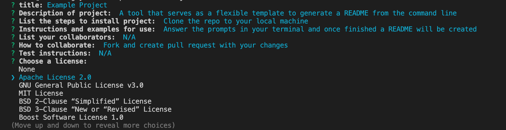

[](https://opensource.org/licenses/MIT)

# Professional README Generator

## Description
Provide developers with a way to generate a readme file in the CLI.

## Table of Contents
- [Installation](#installation)
- [Usage](#usage)
- [Credits](#credits)
- [Contribution](#contribution)
- [Tests](#tests)
- [License](#license)

## Installation
Install by cloning the project

## Usage
Answer the series of prompts
  ```md
    
    ```

## Credits
UCB

## Contribution
Fork the project and create a pull request

## Tests
Create a unit test file

## License
Licensed under <a href="https://opensource.org/licenses/MIT/">MIT License<a>.
See https://opensource.org/licenses/MIT/ for more information.

## Questions?

github handle: frankmng - visit my profile: https://github.com/frankmng<br>
Contact me at <strong>frankmng@email.com<strong> if you have any additional questions!